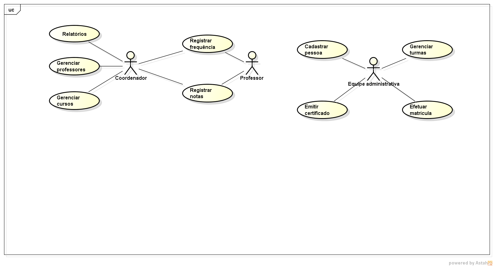
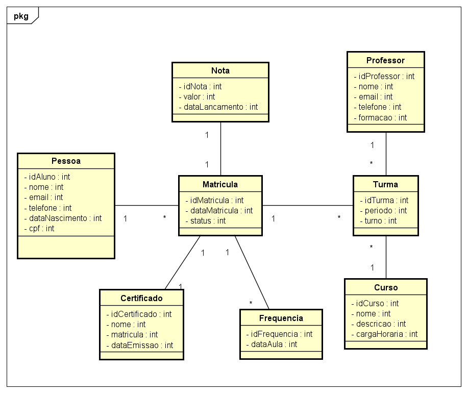

# sistema-controle-academico

Documentação do projeto desenvolvido como atividade da disciplina de APOO

---

## **Visão do Produto**

---

**Objetivo:**  
Este sistema tem como objetivo gerenciar alunos, professores, cursos e turmas de cursos livres, permitindo controle de frequência, notas e emissão de certificados.

---

**Público-Alvo:**  
Usuários como coordenadores, professores e equipe administrativa de instituições de ensino que oferecem cursos livres.

---

**Principais Funcionalidades**  
- Cadastro e gerenciamento de alunos, professores e cursos.  
- Controle de turmas e matrículas.  
- Registro e consulta de frequência e notas.  
- Emissão de certificados para alunos aprovados.  
- Relatórios de desempenho e participação.

---

**Restrições e Premissas**  
- Desenvolvido para uso via navegador (sistema web).  
- Interface responsiva e amigável.  
- Baseado no estudo de caso de Banco de Dados (cursos livres).  
- Tecnologias previstas: HTML, CSS, JavaScript, Python, SQL.

---

## **Casos de Uso**

Os principais casos de uso identificados são:  
1. Realizar cadastro de aluno.  
2. Registrar frequência e notas.  
3. Emitir certificados de conclusão.

---

### **Descrição dos Casos de Uso**

#### **Caso de Uso 1 – Realizar Cadastro de Aluno**
- **Atores:** Coordenador, Equipe administrativa.  
- **Fluxo Principal:**  
  1. O ator acessa a opção "Cadastro de Aluno".  
  2. O sistema exibe o formulário de cadastro.  
  3. O ator preenche os dados obrigatórios (nome, CPF, e-mail, telefone, curso).  
  4. O ator confirma a operação.  
  5. O sistema armazena os dados e exibe mensagem de sucesso.  
- **Fluxos Alternativos:**  
  - Dados inválidos → o sistema informa o erro e solicita correção.  
- **Pré-condições:** Usuário autenticado com permissão de cadastro.  
- **Pós-condições:** Aluno registrado no banco de dados.

---

#### **Caso de Uso 2 – Registrar Frequência e Notas**
- **Atores:** Professor.  
- **Fluxo Principal:**  
  1. O professor acessa a turma na qual ministra aulas.  
  2. O sistema exibe a lista de alunos matriculados.  
  3. O professor registra presença/falta para cada aluno.  
  4. O professor insere notas de avaliações.  
  5. O sistema salva os dados e confirma o registro.  
- **Fluxos Alternativos:**  
  - Caso o professor não tenha permissão na turma, o sistema bloqueia a operação.  
- **Pré-condições:** Turma e alunos cadastrados.  
- **Pós-condições:** Frequência e notas registradas no sistema.

---

#### **Caso de Uso 3 – Emitir Certificados de Conclusão**
- **Atores:** Coordenador, Equipe administrativa.  
- **Fluxo Principal:**  
  1. O ator acessa a opção "Emitir Certificado".  
  2. O sistema exibe a lista de alunos aprovados.  
  3. O ator seleciona o aluno desejado.  
  4. O sistema gera o certificado com base nas informações do curso e do aluno.  
  5. O ator faz o download ou imprime o certificado.  
- **Fluxos Alternativos:**  
  - Caso o aluno não tenha atingido os critérios de aprovação, o sistema informa que o certificado não pode ser emitido.  
- **Pré-condições:** Aluno aprovado.  
- **Pós-condições:** Certificado gerado e registrado no sistema.

---

## **Modelo Conceitual**

O modelo conceitual representa as classes de análise do sistema, com seus principais atributos e relacionamentos.

---

### **Descrição das Classes**

- **Aluno**: Representa os estudantes matriculados. Atributos incluem `idAluno`, `nome`, `email`,`telefone`, `dataNascimento`,`cpf`.  
- **Professor**: Representa os docentes. Atributos incluem `idProfessor`, `nome`, `email`, `telefone`, `formacao`.  
- **Curso**: Contém informações sobre cursos livres. Atributos incluem `idCurso`, `idCurso`, `nome`, `descricao`, `cargaHoraria`.  
- **Turma**: Representa uma oferta de curso em um período específico. Atributos incluem `idTurma`, `periodo`, `horario`.  
- **Matricula**: Relaciona alunos a turmas. Atributos incluem `idMatricula`, `dataMatricula`, `status`.  
- **Frequencia**: Registra presença ou falta de alunos. Atributos incluem `idFrequencia`, `dataAula`.  
- **Nota**: Guarda as avaliações dos alunos. Atributos incluem `idNota`, `valor`, `dataLancamento`.  
- **Certificado**: Documento gerado para alunos aprovados. Atributos incluem `idCertificado`,`nome`,`matricula`,`dataEmissao`.

---

## **Tecnologias Utilizadas**
- Documentação escrita em Markdown.  
- Diagramas elaborados com Astah.  
- Repositório hospedado no GitHub.  

---

## **Equipe**
- Jenyffer Danily de Souza Araújo – Matrícula: 20231011110015  
- Anna Alyssia Dantas de Medeiros – Matrícula: 20251011110041  

---

## **Repositório no GitHub**
🔗 [Acesse o projeto no GitHub](https://github.com/Jenypr/sistema-controle-academico).